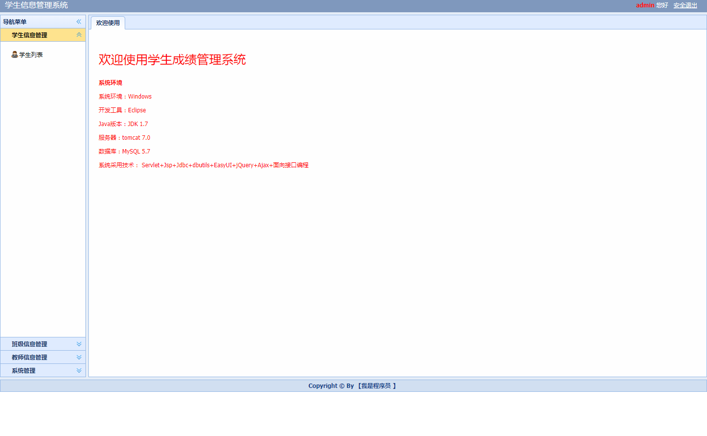

基于ssm的学生信息管理系统

项目代码已收录公众号【java项目源码】，需要请自行关注一下公众号并下载源码

项目框架：servlet+jsp+mysql+layui+ajax+jquery 
本系统分为三种权限： 
1.学生：查看自己信息，修改自己信息，以及修改密码等 
2.教师：管理学生信息（增删改查）,管理班级信息（增删改查）。查看自己信息，修改自己信息，以及修改密码等 
3.管理员：管理学生信息（增删改查）,管理班级信息（增删改查），管理教师信息（增删改查）以及修改密码等 

运行项目步骤： 
1.项目导入本地后可能会出现红色感叹号，右键项目properties选择java build path修改对应红叉的配置 
2.将sql文件导入本地数据库 
3.将util下的DbUtil中修改本地数据库连接 
4.右键项目运行 

修改数据库用户名密码，tomcat应用名改成/

CSDN博客地址：[基于ssm的学生信息管理系统](https://blog.csdn.net/mataodehtml/article/details/118307588)

运行视频地址：[基于ssm的学生信息管理系统](https://www.bilibili.com/video/BV12X4y1A7Ww)

运行截图：

